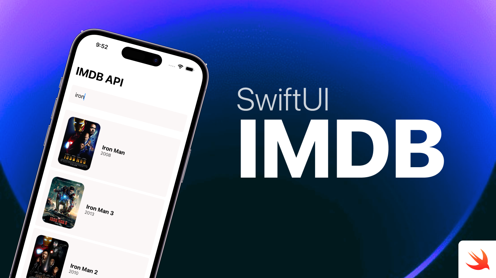

# IMDB-SwiftUI
This was my final project for Harvard University, CS50x Course

IMDB-SwiftUI is an application that uses the OMDB API and is built with SwiftUI. 
 

## Architecture

I designed according to MVVM. In the View, i only do things like layout, animation, initializing UI components, etc. There’s a special layer between the View and the Model called the ViewModel. The ViewModel is a canonical representation of the View. That is, the ViewModel provides a set of interfaces, each of which represents a UI component in the View. We use a technique called “binding” to connect UI components to ViewModel interfaces. So, in MVVM, I don’t touch the View directly, I deal with business logic in the ViewModel and thus the View changes itself accordingly. I write presentational things such as converting Date to String in the ViewModel instead of the View. Therefore, it becomes possible to write a simpler test for the presentational logic without knowing the implementation of the View.

## SwiftUI

IMDB-SwiftUI is in pure Swift UI, the goal is to see how far SwiftUI can go in its current implementation without using anything from UIKit (basically no UIView/UIViewController representable).

It'll evolve with SwiftUI, every time Apple edits existing or adds new features to the framework.

## Platforms
Currently IMDB-SwiftUI runs on iPhone, iPad, and macOS. 

## YouTube Link
You can watch my video introducing my project from the link below.
#### <https://www.youtube.com/watch?v=fXe4_6boUks>
